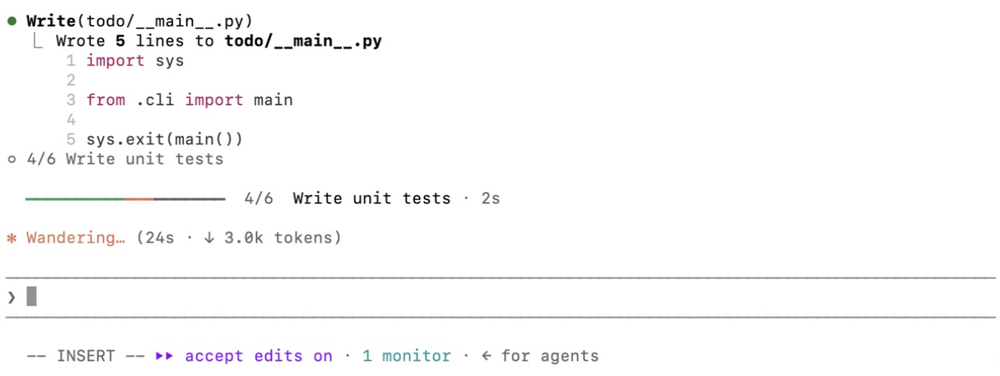

<p align="center">
  
</p>

<p align="center">
  <a href="./LICENSE"></a>
  
  
  <a href="https://linux.do"></a>
</p>

<p align="center"><a href="./README.md">English</a> · 简体中文</p>

长会话里，spinner 只会告诉你 Claude 已经干了多久、花了多少 token。**ccprogress** 把缺的那部分补上：整体计划是什么、现在在做哪一步、还剩几步，并且随着每一步开始和完成实时更新。

## 效果

<p align="center">
  
</p>

<p align="center"><sub>真实的 Desktop 会话：正在执行第 3/6 步，步骤清单已展开。</sub></p>

<p align="center">
  
</p>

在 **Desktop** 里，进度条在整个执行过程中都显示在输入框上方。点 **查看步骤** 会原地展开清单；计划完成后可以点关闭，或者在你发下一条消息时自动清除。

<p align="center">
  
</p>

<p align="center"><sub>真实的终端会话：第 4/6 步已执行 2 秒，这一步的上报折叠成了一行。</sub></p>

<p align="center">
  
</p>

在**终端**里，进度条紧贴在 spinner 上方。每次上报进度在 transcript 里只占一行灰色摘要，比如 `◦ 3/5 运行测试`，不会把整份步骤列表刷屏。

## 安装

```bash
claude plugin marketplace add amigoer/ccprogress
```

```bash
claude plugin install ccprogress@ccprogress
```

也可以在会话里执行 `/plugin marketplace add amigoer/ccprogress` 和 `/plugin install ccprogress@ccprogress`。已经打开的会话需要执行一次 `/reload-plugins`。装在用户级别的插件，终端和 Desktop 都会加载。

装好后，给 Claude 一个需要好几步的任务，它一列出计划，进度条就会出现。

## 原理

ccprogress 是一个 [mod](https://code.claude.com/docs/en/plugins/mods/overview)：一种代码在 Claude Code 内部运行、可以在界面上绘制内容的插件。

**步骤从哪来。** 进度条得有人告诉它有哪些步骤，ccprogress 按顺序使用当前会话里第一个可用的来源：

1. 内置的 `TodoWrite` 工具（版本提供时）。
2. 内置的任务列表（`TaskCreate` / `TaskUpdate`），每次更新后读回 `~/.claude/tasks/` 下的任务文件。当前版本通过设置 `CLAUDE_CODE_ENABLE_TODO_TOOLS=1` 开启这些工具，ccprogress 已经在真实会话里和它们对过一遍。
3. 都没有时，用插件自带的 `update_progress` 工具，比如目前的 Desktop。插件会在系统提示里加一小段说明，请 Claude 在三步及以上的任务里上报计划，并在每一步开始和完成时更新。如果一轮里已经做了 4 个动作还没上报，会追加一句只有 Claude 能看到的简短提醒，你看不到它。

**画在哪里。**

- **终端**：执行中画在 spinner 正上方，空闲时画在输入框上方。
- **Desktop**：始终画在输入框上方。Desktop 目前由自己绘制 spinner 那一行，不接受 mod 在那里画内容。
- **其他环境**（VS Code 插件、`claude -p`、Agent SDK）：不绘制界面，`/progress` 改为输出文字摘要。

**颜色。** 绿色是已完成，橙色是进行中，灰色是还没开始。

**计时与提醒。** Claude 干活时，当前步骤会显示已经用了多久。超过 5 分钟计时变红，并弹出提示说这一步可能卡住了，常见原因是有个权限确认没人点。全部步骤完成时，也会弹出提示并附上总用时。

## 命令

| 命令 | 作用 |
| --- | --- |
| `/progress` | 查看完整步骤清单：终端里打开侧边面板，Desktop 里展开进度栏。Claude 干活时也能用。 |
| `/progress all` | 列出本机最近 24 小时内各会话的计划：项目、当前步骤、上次更新时间。 |
| `/progress clear` | 清空当前计划。 |

## 配置

在 `/config` 里修改，或者执行 `/plugin configure ccprogress@ccprogress`。

| 配置项 | 默认值 | 作用 |
| --- | --- | --- |
| `stuck_minutes` | `5` | 当前步骤用时超过这么多分钟就提醒。设为 `0` 关闭提醒。 |
| `notify` | `toast` | `toast` 只在会话内提醒；`system` 额外发系统通知，macOS 用 `osascript`，Linux 用 `notify-send`。 |
| `fold_reports` | `true` | 在终端 transcript 里把每次进度上报折叠成一行灰色摘要；关闭后显示完整的步骤列表。 |
| `language` | `auto` | 进度条上的文字语言：`en`、`zh`，或 `auto` 跟随步骤的语言。 |

## 须知

- **版本要求**：Claude Code v2.1.287 或更高，从这个版本起 mod 默认开启，可以用 `claude --version` 查看。Desktop 的 WSL 会话不加载插件。
- **子代理**不会覆盖进度条，只显示主对话的计划。
- **恢复会话**：每个会话的计划都会单独保存，`/resume` 后自动恢复，只保留最近 50 个会话。
- **开销**：每次更新是一次很小的工具调用，一个任务大约多花几百 token。系统提示里那段说明约 100 个英文单词，只在 `update_progress` 工具可用时才会加上。补报提醒约 25 个英文单词，每轮最多一次。
- **隐私**：不联网，也不额外调用模型。只有在 `system` 通知模式下，才会启动进程来显示系统通知。计划保存在 `~/.claude/plugins/store/` 下的插件存储里；只在任务列表工具运行时读取 `~/.claude/tasks/` 下的文件。
- **信任**：mod 以你的权限运行。`claude plugin validate plugins/ccprogress` 会列出它挂了哪些事件、调用了哪些 API。
- **早期阶段**：mods API 仍在随 Claude Code 版本变化。

## 其他工具如何读取计划

每个运行 ccprogress 的会话都把计划存在同一个存储里，`/progress all` 就是靠它看到所有会话的。其他工具（比如列出所有会话的脚本）可以读取 `~/.claude/plugins/store/ccprogress_ccprogress-*.json`。这个文件是一个 JSON 对象，每个 `plan:<会话 ID>` 键对应：

```json
{
  "goal": "Ledger CLI",
  "steps": [{ "title": "Run the tests", "status": "in_progress" }],
  "source": "tool",
  "updatedAt": 1790967588567,
  "cwd": "/Users/me/work/ledger"
}
```

`status` 取值为 `pending`、`in_progress`、`completed`；`source` 表示步骤来自插件自带工具（`tool`）、`TodoWrite`（`todo`）还是任务列表（`tasks`）；`updatedAt` 是毫秒时间戳。只读不写：这个文件由 Claude Code 维护。

## 开发

```text
.claude-plugin/marketplace.json     本仓库对外提供的 marketplace
plugins/ccprogress/
├── .claude-plugin/plugin.json      插件清单
├── hooks/register.tsx              事件、工具、命令和界面绘制
├── hooks/view.tsx                  各界面下的进度行、清单和 transcript 摘要
├── hooks/icons.ts                  Desktop 用的 SVG 图标和分段进度条
├── hooks/plan.ts                   步骤解析、进度汇总和终端进度条
├── hooks/words.ts                  中英文文案
├── types/index.d.ts                $.state 的类型约定
└── tests/                          claude plugin test 测试
```

从本地仓库加载插件，保存文件后会自动重载：

```bash
claude --plugin-dir plugins/ccprogress
```

在 Desktop 里调试：把 `plugins/ccprogress` 的绝对路径加到 `~/.claude/settings.json` 的 `env` 里的 `CLAUDE_CODE_PLUGIN_DIRS`，在同一处把 `CLAUDE_CODE_PLUGIN_DIR_WATCH` 设为 `1` 以便保存即重载，然后新开一个会话。如果已经安装过 ccprogress，先把它停用，避免加载两份。

校验和测试：

```bash
claude plugin validate --strict plugins/ccprogress
```

```bash
claude plugin test plugins/ccprogress
```

想在编辑器里得到类型提示，就在仓库根目录启动的会话里执行 `/plugin-types`，它会把类型声明写到 `.claude/types`（`tsconfig.json` 已经包含这个目录）。然后：

```bash
npx -p typescript@5 tsc -p .
```

**发版规则。** 每个 PR 只在 [CHANGELOG.md](CHANGELOG.md) 的"Unreleased"一节记录变更，不改版本号。发版时把这些条目整理到新版本下，并升级 `plugins/ccprogress/.claude-plugin/plugin.json` 里的 `version`，已安装的用户才会收到更新。

## 声明

ccprogress 是社区项目，与 Anthropic 没有关联，也没有得到 Anthropic 的背书。“Claude” 是 Anthropic, PBC 的商标。

## 许可证

[MIT](LICENSE)
